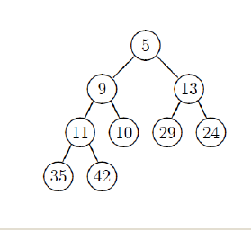
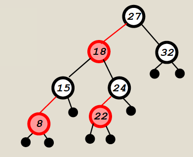

### MCQ

1. What is the asymptotic complexity of `2n log n + 7n -14 log2n`?
    1. O(logn)
    2. O(nlogn)
    3. O(n)
    4. O(n^2)

--- 
```
    for(int i = 0; i < n; i++) {
        for(int j = 0; j < n; j *= 2) {
            System.out.println("WHY IS THIS A QUESTION?");
        }
    }
```
2. How many times will the print statement be executed (in the asymptotic sense)
    1. O(logn)
    2. O(nlogn)
    3. O(n)
    4. O(n^2)

---
```
    public power(long x, intn) {
        double pow = 1;
        if(n==0)
            return 1;
        if (n == 1)
            return x;
        if(n%2==0){
            pow = power(x, n/2);
            return pow * pow; 
        }
        else{
            pow = power(x, n/2);
            return pow * pow * x;
        }
    }
```
3. The code above computes the nth power of x. How many multiplications are performed (in the asymptotic sense)?
    1. O(logn)
    2. O(nlogn)
    3. O(n)
    4. O(nx)

---
4. A binary tree is traversed and the key at each node visited is printed. Which property holds for each tree traversal (preorder, postorder, inorder)?
    1. The root is printed before the nodes in the right subtree.
    2. The nodes in the left subtree are printed before the nodes in the right subtree.
    3. The root is printed after all the nodes in the left subtree.
    4. None of the above.

---
5. Given n elements, what is the best time in which a min-heap can be built?
    1. O(n)
    3. O(nlogn)
    4. O(n^2)
    5. O(logn)

---


6. After the extract-min operation is completed, which node holds entry 42?
    1. The root
    2. The node holding 35
    3. The node holding 10
    4. The node holding 24

---
7. A binary search tree contains keys 1 through 50. The query search(20) is executed. 

    For which of the following sequences exists a tree so that the entries listed are the keys on the path from the root to the node with key 20.

    1. 35 – 15 – 17 – 20
    2. 35 – 27 – 25 – 29 – 20
    3. 35 - 33 - 31 - 22 - 25 - 20
    4. 35 - 10 - 27 - 20

--- 
8. An insertion into a binary search tree consisting if n nodes and having height h has what worst-case time performance (choose smallest that holds):
    1. O(log n)
    2. O(h)
    3. O(log h)
    4. O(n)

---


9. Which element, when inserted into the LL RB-tree, does not cause any rotations or color flips?

    1. Insert(23)
    2. Insert(30)
    3. Insert(5)
    4. Insert(17)
    