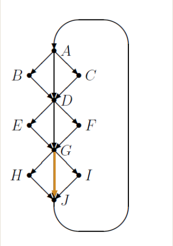
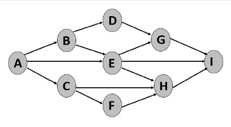
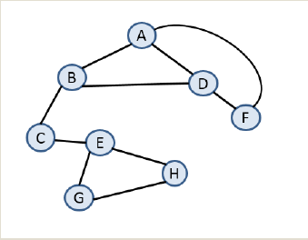

### MCQ

1. What is the asymptotic complexity of `2n log n + 7n -14 log2n`?
    1. O(logn)
    2. O(nlogn)
    3. O(n)
    4. O(n^2)

--- 
```
    for(int i = 0; i < n; i++) {
        for(int j = 1; j < n; j *= 2) {
            func("You think this is a little confusing?");
        }
    }
    for(int p = n; p >= 0; p -= 2) {
        for(int k = n/2; k >=0; k = k/2) {
            func("Suffer");
        }
    }
```
2. How many times will the function `func` be executed (in the asymptotic sense)
    1. O(logn)
    2. O(nlogn)
    3. O(n)
    4. O(n^2)

---
```
    public power(long x, int n) {
        double pow = 1;
        if(n == 0)
            return 1;
        if (n == 1)
            return x;
        if(n % 2 == 0){
            pow = power(x, n / 2);
            return pow * pow; 
        }
        else{
            pow = power(x, n / 2);
            return pow * pow * x;
        }
    }
```
3. The code above computes the nth power of x. How many multiplications are performed (in the asymptotic sense)?
    1. O(logn)
    2. O(nlogn)
    3. O(n)
    4. O(nx)

---
4. A binary tree is traversed and the key at each node visited is printed. Which property holds for each tree traversal (preorder, postorder, inorder)?
    1. The root is printed before the nodes in the right subtree.
    2. The nodes in the left subtree are printed before the nodes in the right subtree.
    3. The root is printed after all the nodes in the left subtree.
    4. None of the above.

---
5. Given n elements, what is the best time in which a min-heap can be built?
    1. O(n)
    3. O(nlogn)
    4. O(n^2)
    5. O(logn)

---


6. After the extract-min operation is completed, which node holds entry 42?
    1. The root
    2. The node holding 35
    3. The node holding 10
    4. The node holding 24

---
7. A binary search tree contains keys 1 through 50. The query search(20) is executed. 

    For which of the following sequences exists a tree so that the entries listed are the keys on the path from the root to the node with key 20.

    1. 35 – 15 – 17 – 20
    2. 35 – 27 – 25 – 29 – 20
    3. 35 - 33 - 31 - 22 - 25 - 20
    4. 35 - 10 - 27 - 20

--- 
8. An insertion into a binary search tree consisting if n nodes and having height h has what worst-case time performance (choose smallest that holds):
    1. O(log n)
    2. O(h)
    3. O(log h)
    4. O(n)

---


9. Which element, when inserted into the LL RB-tree, does not cause any rotations or color flips?

    1. Insert(23)
    2. Insert(30)
    3. Insert(5)
    4. Insert(17)

--- 
10. Bob uses a stack instead of a queue when implementing breadth-first search (BFS) on an undirected graph G (no weights on the edges).
BFS with a stack starting at vertex s correctly computes single source shortest paths entries (from to every vertex).

    1. True
    2. False

---


11. A DFS is started at vertex A. The adjacency lists contain vertices in sorted order (smallest to largest). What type of edge is <G,J> in the DFS exploration?
    1. Tree edge
    2. Cross edge
    3. Forward edge
    4. Back edge

---


12. The DAG below represents course prerequisites.If a student can take at most 2 courses per semester, does the minimum number of semesters needed equal the number of vertices on the longest path?

    1. Yes
    2. No
    3. Spare me

---


13. A DFS is started at vertex A. Which of the orderings cannot be the result of visiting the vertices during DSF? (You don’t know how vertices are arranged in the adjacency lists.)

    1. ADBCEGHF
    2. ADFBCEHG
    3. ABDFCEGH
    4. ABDCEGHF

---
14. What is the maximum number of leaves a binary search tree, of size h, can have?
    1. h
    2. h^2
    3. 2^h
    4. h^h

---
15. A data structure on nelements needs to support the operations insert, search, delete, and report-minin O(log n) worst-case time per operation. What data structure achieves this bound?

    1. Priority queue (implemented as a heap)
    2. Linked list with elements maintained in sorted order
    3. Binary Search tree
    4. Balanced Search tree
    5. Hashing

---
16. H is a max-heap built on n elements.What operations run in time O(log n)?

    1. Insert(x) [no searching needed]
    2. Extract max
    3. Search(x)
    4. Delete(x) [knowing where x is]

---
17. G is directed graph represented by an adjacency matrix A. Given three vertices u, v, and w, we can determine whether they form a triangle in what time?

    1. O(1)
    2. O(log n)
    3. O(n)
    4. O(n + m)

---
18. G=(V,E) is an undirected graph with n vertices and m edgesrepresented by adjacency lists. We can determine whether G contains 6 vertices having degree 3 in what time? Choose the smallest time bound achievable.
    1. O(1)
    2. O(n^2)
    3. O(n)
    4. O(n + m)

---
Many questions are based on Susanne Hambruche's clicker questions from Fall 2016.


